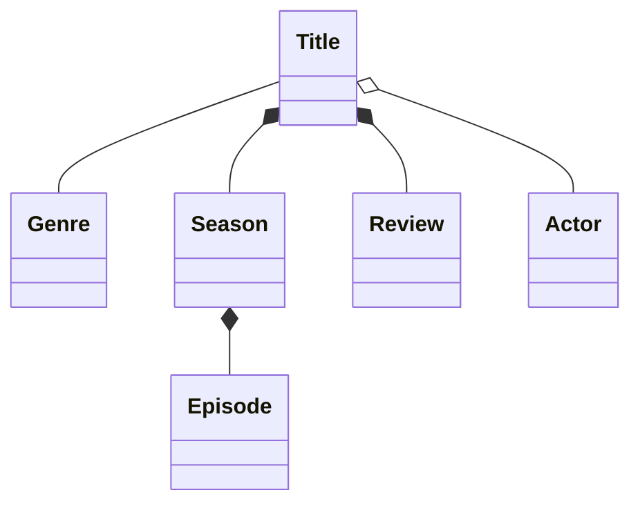

## Ch 01: Document the Domain

### Overarching Goal
- Explore the life cycle of creating an application from scratch.
- We will write zero application code.
- We will be documenting the important steps with diagrams.
### Domain modeling
- The primary way of determining the important aspects of a business.
- Collaboration: engineering, product, and business stakeholders.
- Goals: 
	- Alignment on what the domain model looks like.
	- Share a common language. 
		- Use the same terminology, from nontechnical stakeholders to technical team members.
	- Allow the domain and code to evolve over time.
		- Since the domain is documented, it can be revisited at any point.
- The UML class diagram can be used to also model domains, including relationships.

> [!tip]- Recommended Reading: ==DDD==
> - 📚 [Domain-Driven Design: Tackling Complexity in the Heart of Software](https://a.co/d/02yw8cgy).
> - 📄 [The Ultimate List of Domain Driven Design Books (2024)](https://www.workingsoftware.dev/the-ultimate-list-of-domain-driven-design-books-in-2024/).

### Steps
1. Determine the important entities
	- An ==entity== represents a core concept within the business.
2. Document the relationships
	- Multiple kinds: association, aggregation, composition, etc.

	```mermaid
	classDiagram
		Title -- Genre
	```
### Relationships

|            | Association                                          | Aggregation                                            | Composition                                   |
| ---------- | ---------------------------------------------------- | ------------------------------------------------------ | --------------------------------------------- |
| Coupling   | loosest                                              | intermediate                                           | tightest                                      |
| Dependency | both entities can exist independently of one another | if the "parent" is deleted, the "child" ca still exist | the "child" cannot exist without the "parent" |
| Owner      | none                                                 | the "parent" <br>_(the entity holding the reference)_  | the "parent"                                  |
| Syntax     | peer `--` peer                                       | parent `o--` child                                     | parent `*--` child                            |
| Render     | solid line                                           | empty diamond                                          | solid diamond                                 |
| Example    | `Student -- Teacher`                                 | `Teacher o-- Class`                                    | `Class *-- Grade`                             |


