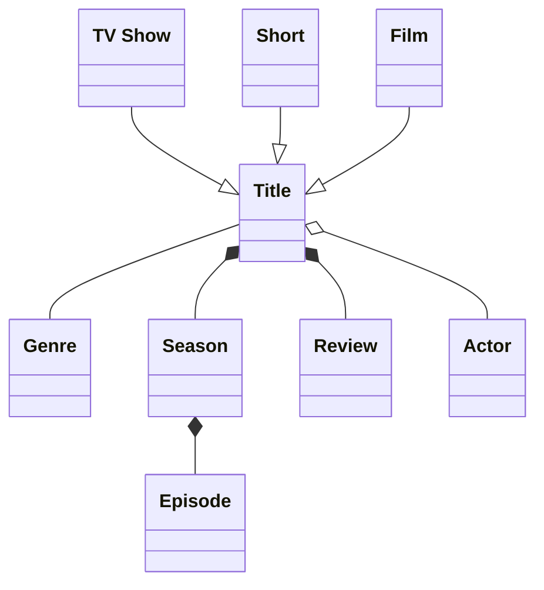
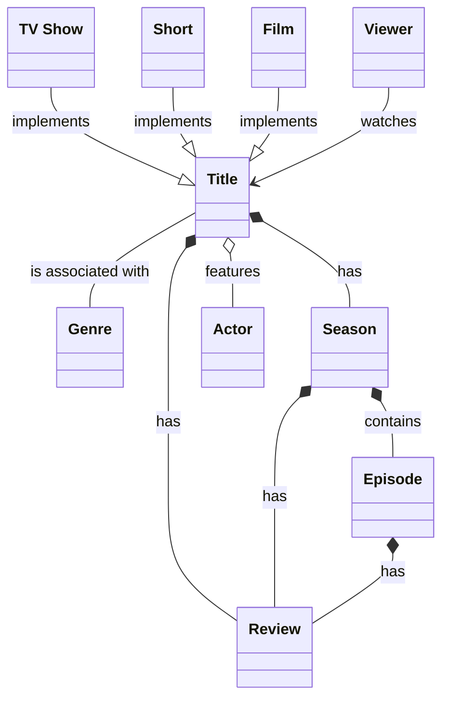
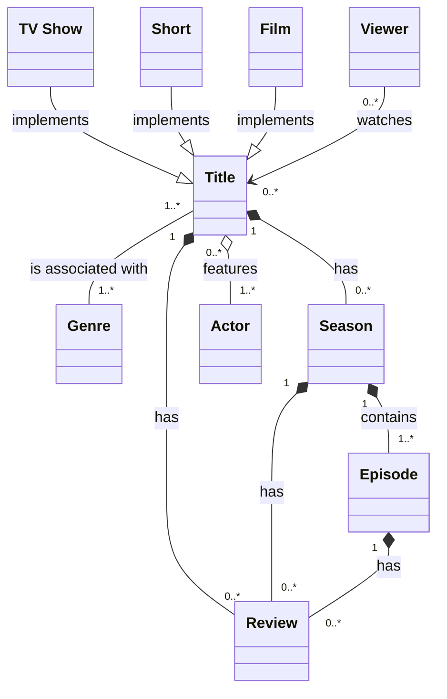
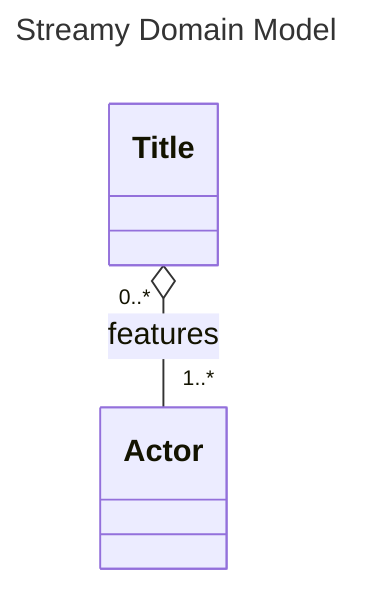

## Ch 02: Enhance the Domain Model

### Review
- The basics of domain modeling.
- The basics of how to create a domain model with Mermaid.

### Overview
- Use ==generalization== to define more specific types.
- Provide extra information with ==labels==, ==multiplicity==, adding a ==title==, etc.

### Generalizations
From a business perspective,
- A `Title` is deliberately an abstract term.
- To be more specific, _Streamy_ may want to offer `TV Show`, `Film`, and `Short`.
- In ==OOP==, these might be represented as ==subclasses==.
- In ==UML==, they may be represented using a ==generalization==.
	- Defined using `--|>`.
	- Rendered as empty arrows.

#### Mermaid's powerful rendering
- Benefit over more manual tools: allow rapid iteration over a domain model.

### Label relationships
Describe how entities relate to each other.
- Remember to be as descriptive as possible.
- Avoid using `has` for everything where possible.
- The labels describe the relationship from the parent's perspective.

#### Directional associations
As seen in `Viewer --> Title`
- Instead if a bidirectional association (`Title -- Genre`).
- This means that
	- `Viewer` holds a reference to `Title`.
	- `Title` does ==not== hold a reference to `Viewer`.
	- Naturally, this means that a viewer can watch titles, while the inverse is not true.
- For bidirectional associations — where both entities can reasonably hold references to one another — the labels should also describe the relationship in a way that works for both.

> [!caution]- Using `implements` is highly-coupled to inheritance/OOP
> 
> I would appreciate loosening up this conceptual coupling to become more inclusive of other programming paradigms. For now, I deliberately choose ==not== to invest time in identifying a more suitable alternative, yet there is hope this note will serve when the time comes.

### Multiplicity
Our domain model is almost complete
1. Added entities.
2. Linked them via relationships.
3. Described the way in which they are related.
4. ==Next:== How many of one kind of entity relates to another?  
	- This is known as the relationship's ==multiplicity== when referring to both sides, collectively.
	- When referring to each side, it is known as a single entity's ==cardinality==.

How do I read `Title "0..*" o-- "1..*" Actor: features`?
-  A `Title` features (`1..*`) one-to-many `Actor`s.
- An `Actor` is featured in (`0..*`) zero-to-many `Title`s.

Examples of common cardinalities:
- one-to-one
- one-to-many
- zero-to-many
- many-to-many

#### (Always) Add a Title

